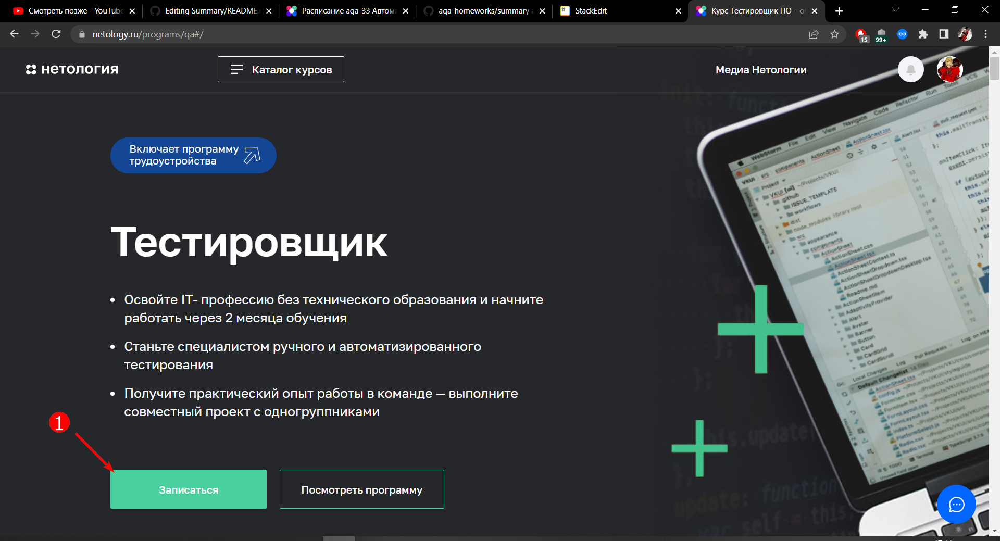

## Перечень автоматизируемых сценариев

**Сценарии тестирования UI:**

 1. Навигация с [главной страницы](https://netology.ru/) на [страницу формы](https://netology.ru/programs/qa) заявки на курс "Тестировщик" через [каталог курсов раздел "Программирование"](https://netology.ru/development) с проверкой фильтрации по курсам
 
 
 
 2. Навигация с [главной страницы](https://netology.ru/) на [страницу формы](https://netology.ru/programs/qa) заявки на курс "Тестировщик" через ["Каталог курсов"](https://netology.ru/navigation) с проверкой фильтрации по курсам
 
 
 
 3. Навигация с [главной страницы](https://netology.ru/) на страницу [каталога курсов раздела "Программирование"](https://netology.ru/development) через [раздел "Направления обучения"](https://netology.ru/#/directions) 
 
 
 4. Навигация с [главной страницы](https://netology.ru/) на страницу [каталога курсов раздела "Программирование"](https://netology.ru/development) через [раздел "Раскройте свои сильные стороны"](https://netology.ru/#/steps) 
 
 
 5. Навигация с [главной страницы](https://netology.ru/) на [страницу формы](https://netology.ru/programs/qa) заявки на курс "Тестировщик" через [раздел "Студенты"](https://netology.ru/#/students)
 

 6. Навигация с футера [главной страницы](https://netology.ru/) на страницу ["Каталог курсов"](https://netology.ru/navigation)
 

 7. Навигация с футера [главной страницы](https://netology.ru/) на страницу ["Популярные курсы"](https://netology.ru/popular)
 

 8. Навигация с футера [главной страницы](https://netology.ru/) на страницу [каталога курсов раздела "Программирование"](https://netology.ru/development)
 

 9. Навигация с [главной страницы](https://netology.ru/) на [страницу формы](https://netology.ru/programs/qa) заявки на курс "Тестировщик" через [рекламное предложение на главной](https://netology.ru/development) с проверкой фильтрации по курсам
 
 

 10. Проверка перехода сверху [страницы курса "Тестировщик ПО"](https://netology.ru/programs/qa#/) к [форме записи](https://netology.ru/programs/qa#/order) на курс
 

 11. Проверка появление кнопки "Записаться" и перехода по ней с header [страницы курса "Тестировщик ПО"](https://netology.ru/programs/qa#/) к [форме записи](https://netology.ru/programs/qa#/order) на курс
 

 12. Положительное тестирование [формы записи](https://netology.ru/programs/qa#/order) на курс "Тестировщик ПО", включая проверку ввода промокода и перехода на страницы с условиями [политики](https://netology.ru/legal/11)  и  [пользовательского соглашения](https://netology.ru/legal/6)
 
 
 13. Тестирование на невалидные значения в [форме записи](https://netology.ru/programs/qa#/order) на курс "Тестировщик ПО"
 14. Тестирование на пустые поля в [форме записи](https://netology.ru/programs/qa#/order) на курс "Тестировщик ПО"

**Сценарии тестирования API:**

 1. Положительная проверка соответствия отправленного клиентом и принятого сервером данных
 2. Негативные проверки с отправкой невалидных данных серверу
 3. Негативные проверки с отправкой пустого и/или неполного body серверу

## Перечень используемых инструментов с обоснованием выбора

 1. **IDE:** IntelliJ IDEA
 2. **Язык программирования:** Java
 3. **Система сборки:** Maven, Gradle (на усмотрение тестировщика)
 4. **Тестовая среда:** JUnit4, JUnit5, TestNG (на усмотрение тестировщика)
 5. **Система репортинга:** Allure (более сложные системы репортинга будут излишни)
 6. **Фреймворк для UI тестирования:** Selenide (популярный и простой инструмент)
 7. **Фреймворк для API тестирования:** REST Assured вместе с JSON Schema Validator (для отправки необходимых запросов и валидации JSON схемы)
 8. **Фреймворки для управления данными:** Java Faker (для генерации данных), необходимый драйвер для подключения к БД и DBUtils (для работы с БД), Gson (для генерации body запросов)

## Перечень необходимых разрешений/данных/доступов

 1. Разрешение на проведение автотестирования
 2. Доступ на чтения БД
 3. Доступ к существующим тестовым данным(если они есть)

## Перечень и описание возможных рисков при автоматизации

При тестирование на продакшене при отправки формы (как при UI, так и при API тестирование) существует риск появления "мусорных" записей в БД, также у менеджеров по работе с клиентами появятся "ложные" запросы на обратный звонок от наших тестов. Не забудем, что запуск тестов вызовет дополнительную нагрузку на сервер, что потенциально может привести к проблемам у клиентов с доступам к ресурсу.

При изменение фронтэнда наши тесты рискуют потерять актуальность. Поэтому для поддержания актуальности необходимо будет выделить специалиста. Особенно это проблема будет актуально в случаи различных рекламных и других временных акций.

## Перечень необходимых специалистов для автоматизации

Данный проект не сложный, поэтому будет достаточно junior инженера по автоматизации, который знаком с основами необходимого инструментария, основами UI и API тестирования и базовыми навыками написания автотестов с использованием паттерна Page Object.

## Интервальная оценка с учётом рисков (в часах)

После согласования всех необходимых соглашений и доступов, у juniar специалиста написание тестов займет 16 - 24 часа.
